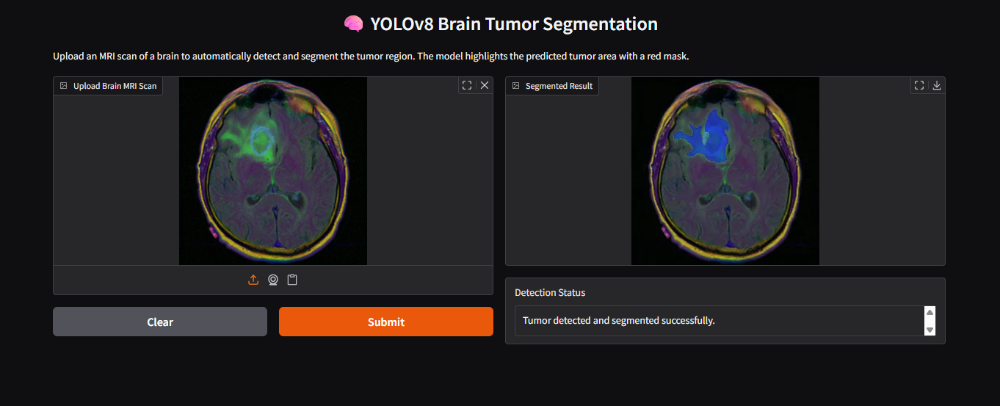

# 🧠 Brain Tumor Segmentation using YOLOv8

This project provides an end-to-end solution for detecting and segmenting brain tumors from MRI scans using a custom-trained YOLOv8 model. It features a user-friendly web interface built with Gradio for easy interaction and visualization.




## ✨ Features

* **Accurate Segmentation**: Utilizes a fine-tuned YOLOv8 model to precisely identify and segment tumor regions in MRI images.
* **Interactive Web UI**: A simple and intuitive interface powered by Gradio allows users to upload an MRI scan and instantly see the segmented output.
* **Real-time Inference**: The model quickly processes the input image and overlays a semi-transparent mask on the detected tumor.
* **Reproducible Training**: The complete model training process is documented in the included Jupyter Notebook (`brain-mri-image-segmentation-using-yolov8.ipynb`).

---

## 💻 Technologies Used

This project is built with the following core technologies and libraries:

* **Python 3.11**
* **PyTorch**: The deep learning framework used by YOLOv8.
* **Ultralytics YOLOv8**: For model training and inference.
* **Gradio**: To create and deploy the user-friendly web interface.
* **OpenCV**: For image processing and manipulation.
* **NumPy**: For numerical operations.
* **Jupyter Notebook**: For model development and experimentation.

---

## 📂 Project Structure

The repository is organized as follows:

```
├── app.py              # The main Gradio application script
├── best.pt             # Trained YOLOv8 model weights (Note: Add to .gitignore)
├── requirements.txt    # A list of Python dependencies for the project
├── brain-mri-image-segmentation-using-yolov8.ipynb # The notebook used for training the model
└── README.md           # This file
```

---

## ⚙️ Installation

To set up and run this project on your local machine, follow these steps:

**1. Clone the Repository**
```bash
git clone [[https://github.com/your-username/your-repository-name.git](https://github.com/your-username/your-repository-name.git)
cd your-repository-name](https://github.com/Taksha03/gradio_brain_tumor_image_segmentation.git)
```

**2. Create a Virtual Environment (Recommended)**
```bash
# For Windows
python -m venv venv
venv\Scripts\activate

# For macOS/Linux
python3 -m venv venv
source venv/bin/activate
```

**3. Install Dependencies**
Install all the required packages using the `requirements.txt` file.
```bash
pip install -r requirements.txt
```

**4. Download the Model**
You will need the trained model weights file, `best.pt`. Place this file in the root directory of the project.

---

## 🚀 Usage

Once the installation is complete, you can run the application.

**1. Launch the Gradio App**
Execute the `app.py` script from your terminal:
```bash
python app.py
```

**2. Open the Interface**
The terminal will display a local URL (e.g., `http://127.0.0.1:7860`). Open this URL in your web browser.

**3. Test the Segmentation**
Drag and drop a brain MRI image onto the input panel or use the upload button. The model will process the image, and you will see the output with the segmented tumor highlighted in red.
